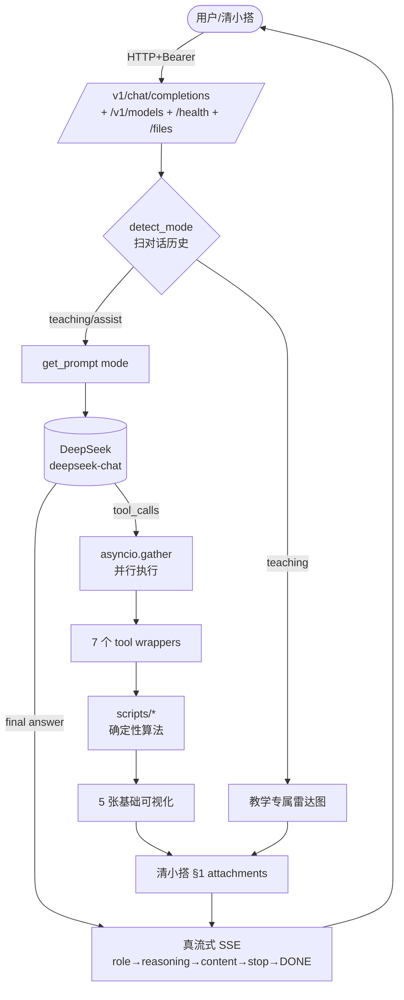

# Isaac Lab RL Co-pilot — Agent Server

> **OpenAI-compatible HTTP wrapper around the skill's 7 modules**. Deploy as a chat agent that plugs into 清小搭智能体广场 via "标准协议接入" wizard, or any OpenAI-compatible client.

## 这是什么

把 skill（`scripts/` 下 7 个确定性模块）包装成 OpenAI 兼容 HTTP 服务：
- **DeepSeek** 作为 LLM 后端，function calling 调度 7 个工具
- **清小搭 §1 attachments** 协议输出文件（reward 代码、可视化 PNG）
- **清小搭 §3.2 SSE** 流式响应（真流式，TTFB ~2s）
- **双模式（教学 / 辅助）**——同一 agent，两种交互风格
- **可视化**——5 张基础 PNG + 教学专属 sim-to-real 雷达图

## 架构



## 双模式

| 模式 | 触发 | 风格 | 专属 attachment |
|------|------|------|----------------|
| **教学** | 用户消息含"教学模式" | 详细讲解 + 类比 + 引用 references + 理解检查 + 学习路径菜单 | `sim2real_radar.png`（DR 覆盖度雷达图） |
| **辅助** | 默认 / "辅助模式" | 精简、直接给方案、数值范围 | — |

每次响应正文首行带 `[教学模式]` / `[辅助模式]` 标签（代码层强制添加）。

## 快速开始

### 1. 环境搭建（conda）

```bash
conda create -n isaac-agent python=3.11 -y
conda activate isaac-agent
cd agent_server
pip install -r requirements.txt

# 配置密钥
cp .env.example .env
# 编辑 .env 填入 DEEPSEEK_API_KEY
```

### 2. 启动服务

```bash
python main.py
# 或: uvicorn main:app --host 0.0.0.0 --port 8765 --reload
```

默认监听 `http://localhost:8765`，`baseUrl` 填 `http://localhost:8765/v1`。

### 3. 自测

```bash
# 1) /health
curl http://localhost:8765/health

# 2) 列出模型（连通性 + 凭证）
curl -H "Authorization: Bearer $AGENT_API_KEY" http://localhost:8765/v1/models

# 3) 非流式对话
curl -X POST http://localhost:8765/v1/chat/completions \
  -H "Authorization: Bearer $AGENT_API_KEY" \
  -H "Content-Type: application/json" \
  -d '{"messages":[{"role":"user","content":"教学模式\n帮我生成四足机器人前进的 reward"}]}'

# 4) 流式（清小搭 §3.2 帧序：role → reasoning → content → stop → [DONE]）
curl -N -X POST http://localhost:8765/v1/chat/completions \
  -H "Authorization: Bearer $AGENT_API_KEY" \
  -d '{"stream":true,"messages":[{"role":"user","content":"教学模式\n你好"}]}'
```

### 4. 测试

```bash
# mock 测试（默认，不烧 token）
pytest tests/

# 真实 DeepSeek e2e（花 token）
AGENT_RUN_REAL_LLM=1 pytest tests/test_real_llm.py -s
```

41 测试 + 2 真实 LLM（按需开启）。

## 接入清小搭广场

填入向导：
- **API 地址**：`http://<公网 host>:8765/v1`（需公网可达，本地开发用 ngrok / cloudflare tunnel 穿透）
- **API 密钥**：`.env` 里 `AGENT_API_KEY`
- **鉴权方式**：Bearer Token

### 关键：配置 `PUBLIC_BASE_URL`

清小搭 §1 spec 要求 attachments 只放 URL。reward_synthesizer 把代码写到 `logs/files/<uuid>.py`，attachment 里 `fileUrl = ${PUBLIC_BASE_URL}/files/<uuid>.py`。**`PUBLIC_BASE_URL` 必须是清小搭能访问到的地址**。

```bash
# .env
PUBLIC_BASE_URL=http://localhost:8765           # 本地开发
PUBLIC_BASE_URL=https://your-ngrok-domain.io    # 公网部署
```

### 开场白配置（清小搭平台加载时显示）

```
你好！我是 Isaac Lab RL Engineering Co-pilot。

我可以帮你：
- 生成 reward 代码（NL → Isaac Lab RewardsCfg）
- 诊断训练崩溃（tensorboard 日志 → 失败模式 + 修复）
- 配置 Domain Randomization（按机器人类型推荐参数）
- 设计 curriculum（任务太难学不会时）

请先选择对话模式：
- 回复"教学模式"——详细讲解 + 引用文档 + 类比 + 理解检查（适合学生）
- 回复"辅助模式"——直接给方案 + 数值范围（适合工程师）
```

可附预生成的 `mode_select_card.png`（位置 `logs/files/mode_select_card.png`，由 `scripts/utils/mode_card.py::make_mode_select_card()` 生成）。

## 关键技术特性

| 特性 | 实现 | 文档 |
|------|------|------|
| **真流式 SSE** | tool 调用阶段实时输出 reasoning 帧（TTFB ~2s） | §1 |
| **真实 token usage** | DeepSeek 返回的 usage 透传，不再字符数估算 | §2 |
| **工具并行执行** | asyncio.gather + threadpool，多 tool 时延减半 | §3 |
| **DeepSeek prompt caching** | 自动利用 prefix 缓存，省 ~50% 输入 token | §4 |
| **失败重试（指数退避）** | 429/5xx/网络错误自动重试 3 次 | §5 |
| **`/health` 扩展** | 9 skill 模块加载检查 + DeepSeek 配置 + 文件统计 | §6 |
| **教学模式专属可视化** | sim2real_radar.png（DR 覆盖度雷达图） | §7 |

详见 `agent_server/技术演进文档.md`。

## 模型成本控制

DeepSeek 当前可用别名（截至 2026-08）：
- `deepseek-chat` → 当前解析为 `deepseek-v4-flash`（便宜，开发推荐）
- `deepseek-reasoner` → 当前解析为 `deepseek-r1`（~10× 价格，推理更强）

监控后台 token 消耗：https://platform.deepseek.com/usage

## 目录结构

```
agent_server/
├── .env / .env.example          # 本地密钥（gitignored）
├── main.py                      # FastAPI 入口（端点 + lifespan）
├── core/
│   ├── config.py                # 环境变量 + 鉴权
│   ├── prompts.py               # 双模式 SYSTEM_PROMPT
│   ├── artifacts.py             # 清小搭 §1 attachment 构造
│   ├── llm_client.py            # DeepSeek + 工具调度 + 流式
│   └── sse.py                   # 清小搭 §3.2 SSE 帧
├── tools/                       # 7 个 tool wrapper
│   ├── __init__.py              # tool registry
│   └── *.py
├── tests/                       # 41 测试 + 2 真实 LLM
├── logs/files/                  # 生成的 attachment（gitignored）
├── 技术演进文档.md              # 开发记录（7 个技术闪光点）
└── requirements.txt
```

## 与 skill 的关系

agent_server **复用** skill 的 `scripts/`、`resources/`、`templates/`、`references/`、`tests/test_data/`，**不复制代码**。skill 走 Claude Code 直接调用，agent 走 HTTP + DeepSeek function calling 调度——两种形态，同一核心。

agent_server 整个子目录可独立删除而不影响 skill：
```bash
rm -rf agent_server/
```

## 清理

```bash
conda env remove -n isaac-agent
```
