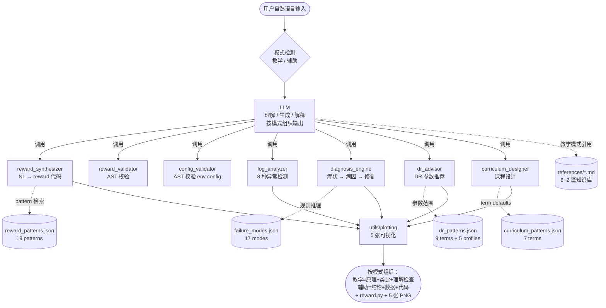
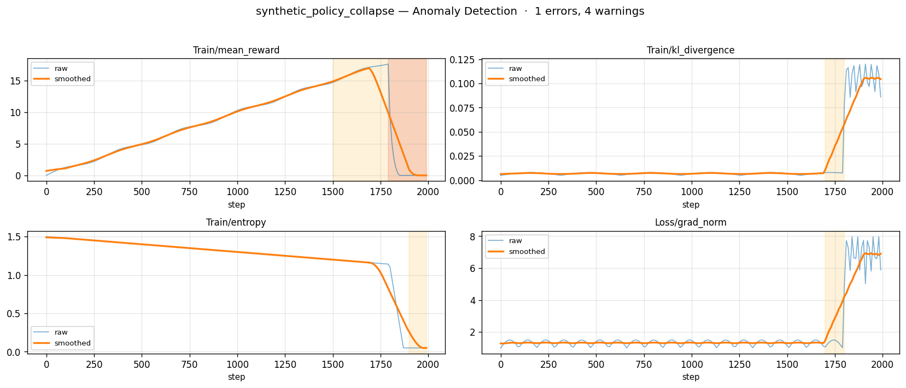
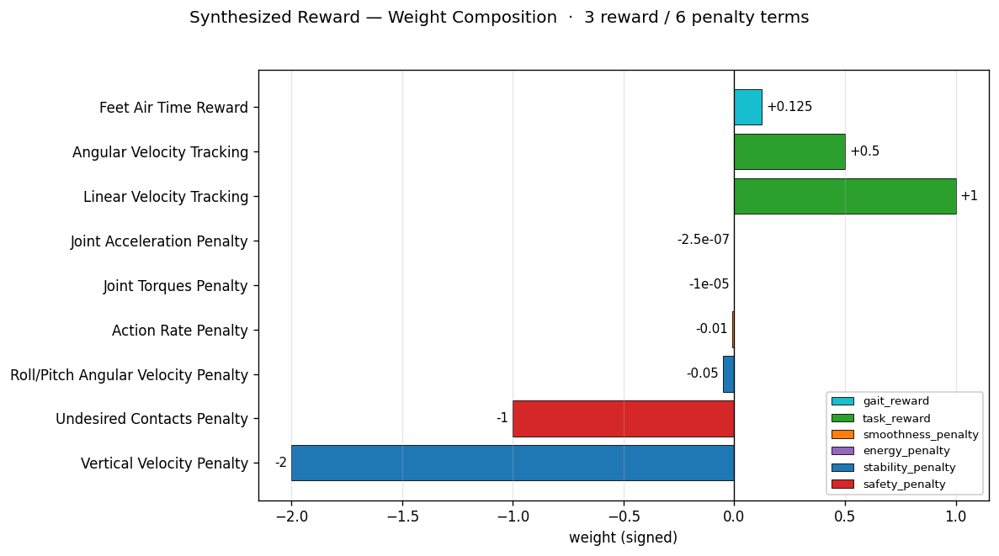
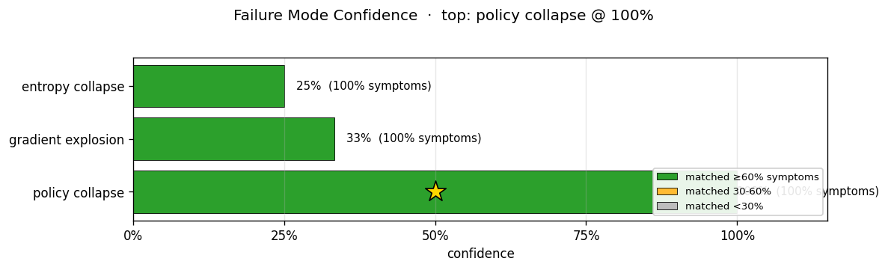
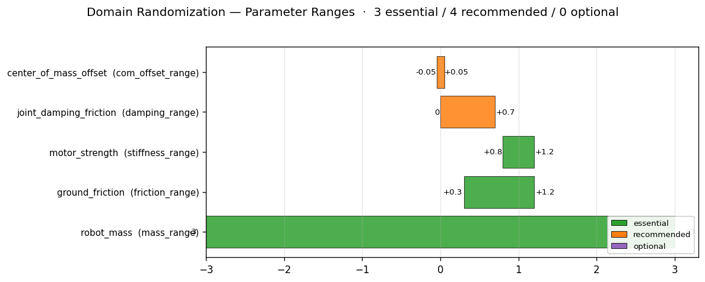
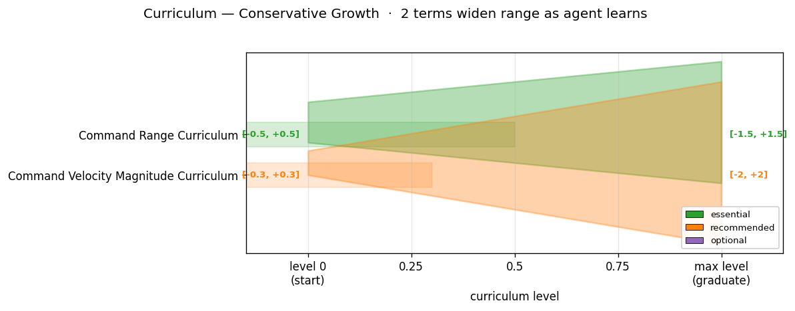

# Isaac Lab RL Engineering Co-pilot

> **自然语言 → Isaac Lab reward 代码 + 训练诊断 + DR/curriculum 推荐**，支持**教学 / 辅助双模式** —— 让 Isaac Lab RL 工程从玄学变工程。

一个把 LLM 的自然语言理解能力与确定性算法（pattern 检索、AST 静态分析、日志解析、规则推理）结合的 skill 包。LLM 做它擅长的（理解、生成、解释），scripts 做它擅长的（确定性计算、可验证），所有 pattern 数据 grounded 在真实源码（legged_gym、IsaacLab、IsaacGymEnvs、Walk These Ways、PPO 论文）。

## 这是什么

一个为 Isaac Lab RL 开发者打造的 skill 包。它不是又一个 LLM 包装器，而是把 LLM 的自然语言理解能力与确定性算法（pattern 检索、AST 静态分析、日志解析、规则推理）结合起来，覆盖 Isaac Lab 工程开发的全流程：

| 痛点 | 模块 | 输入 → 输出 |
|------|------|------------|
| Reward 设计是黑艺术 | **reward_synthesizer** | NL 任务描述 → 可执行 RewardsCfg 代码 |
| 生成代码可能有 bug | **reward_validator** | reward 代码 → AST 静态检查报告（7 项） |
| 配置复杂易踩坑 | **config_validator** | env config 文件 → AST 静态检查报告（8 项） |
| 训练失败靠玄学 | **log_analyzer + diagnosis_engine** | tensorboard 日志 → 症状 → 病因排序 + 修复建议 |
| 不知加什么 DR | **dr_advisor** | robot_type + task_type → EventsCfg（含参数范围） |
| 课程设计没头绪 | **curriculum_designer** | task_type → CurriculumCfg（含参数范围） |

### 双模式

同一套 7 个模块，两种输出风格（说"教学模式"或"辅助模式"随时切换）：

| 模式 | 适合人群 | 输出结构 |
|------|---------|---------|
| **教学** | 学生 / 想理解原理的人 | 结论 → 原理讲解 → 类比 → 引用 references + sources → 学习资源 → 理解检查问答 → 学习路径菜单 |
| **辅助**（默认） | 赶工的工程师 | 结论 → 关键数据（数值范围） → 可直接用的代码 → 下一步建议 |

## 为什么需要它

Isaac Lab 是当前机器人 RL 的事实标准框架，但工程门槛极高：
- Reward 函数设计是"黑艺术"——试错成本高、经验难传承
- 训练失败诊断靠玄学——看 tensorboard 一头雾水
- 配置系统复杂——一个维度不匹配能调一天
- DR/课程参数无标准——散落在各仓库的 config 里

现有工具（ChatGPT 等）只有泛化 RL 知识，无专门针对 Isaac Lab 的工程化助手。NVIDIA Eureka 论文（2023）做过 LLM 生成 reward 的研究原型，但仅限 reward 生成，未产品化为全流程工具。本 skill 填补这个空白。

## 架构



文字版同上：

```
LLM（自然语言理解、代码生成、解释）
        ↓ 调用
scripts（确定性算法层，7 个核心模块）
├── reward_synthesizer.py     ← NL → reward 代码（pattern 检索 + Jinja2 渲染）
├── reward_validator.py       ← AST 静态校验生成代码
├── config_validator.py       ← AST 静态校验 env config
├── log_analyzer.py           ← tensorboard 解析 + 8 种异常检测器
├── diagnosis_engine.py       ← 症状 → 病因 → 修复（规则推理 + 模糊匹配）
├── dr_advisor.py             ← robot/task → EventsCfg（含参数范围）
└── curriculum_designer.py    ← task → CurriculumCfg（含参数范围）
        ↑ 查询
resources（curated 知识库，4 个 JSON 数据库）
├── reward_patterns.json      ← 19 个 reward term（locomotion + manipulation）
├── failure_modes.json        ← 17 个失败模式（9 大类）
├── dr_patterns.json          ← 9 个 DR term + 5 个 robot profile
└── curriculum_patterns.json  ← 7 个 curriculum term
```

**核心思想**：LLM 做它擅长的（理解、生成、解释），scripts 做它擅长的（确定性计算、可验证）。所有 pattern 数据 grounded 在真实源码（legged_gym、IsaacLab、IsaacGymEnvs、Walk These Ways、PPO 论文），每个 entry 都有 sources 字段标注出处与 pitfalls 列出常见陷阱。

### 可视化输出

`scripts/utils/plotting.py` 提供五个绘图函数，把核心模块的输出从纯文本升级为图表（matplotlib，headless PNG）：

| 图 | 来源模块 | 内容 |
|----|---------|------|
| 异常曲线图 | `log_analyzer` | 训练曲线 + 检测到的异常窗口（红/黄阴影）+ 关键点标注 |
| Reward 权重分布 | `reward_synthesizer` | 每个 reward term 的 weight 柱状图，按 category 上色 |
| 病因置信度 | `diagnosis_engine` | 候选 failure mode 的 confidence 排序，星标 top-1 |
| DR 参数范围 | `dr_advisor` | 每个 DR term 的 (min, max) 区间，按 essential/recommended/optional 分层 |
| 课程进阶图 | `curriculum_designer` | 喇叭口扩张，初始范围 → 最终范围，体现 conservative growth |

`examples/end_to_end_demo.py` 自动调用这五个函数，把 PNG 嵌入到 `report.md`。

#### 示例截图

下面是 `python examples/end_to_end_demo.py` 生成的 5 张实际 PNG（`assets/demo_screenshots/`）：

**异常曲线图（log_analyzer 在 policy_collapse 日志上的检测）**：


**Reward 权重分布（reward_synthesizer 生成的 weight composition）**：


**病因置信度（diagnosis_engine 排出的候选 failure mode）**：


**DR 参数范围（dr_advisor 给 Go2 推荐的 DR term 区间）**：


**课程进阶（curriculum_designer 的喇叭口扩张）**：


## 快速开始

### 环境要求

- Python 3.10+
- pip（安装依赖）
- （可选）Claude Code CLI，如果想用 LLM 对话方式调用
- （可选）Isaac Lab v1.x，仅运行时验证需要；静态分析与日志解析不需要

### 三种部署方式

本 skill 提供三种使用方式，按你的环境选一种即可。

---

#### 方式 A：Python API 直接调用（最简单，无需任何 LLM 工具）

适合：想快速验证 skill 功能、想在自己的代码里集成、不想装 Claude Code。

```bash
# 1. 解压 ZIP（解压后直接是项目文件，无外层包装）
unzip isaac-lab-rl-copilot.zip
cd isaac-lab-rl-copilot/

# 2. 装依赖
pip install -r requirements.txt

# 3. 跑测试验证（319 个，应全过）
pytest tests/

# 4. 跑端到端 demo（6 模块串起来，无 GPU 依赖）
python examples/end_to_end_demo.py
# 输出在 examples/end_to_end_demo_outputs/：
#   - report.md        人类可读报告
#   - reward_generated.py   合成的 reward 代码
#   - raw.json         原始结构化数据

# 5. 在自己代码里调用 7 个模块
python
>>> from scripts.reward_synthesizer import RewardSynthesizer
>>> result = RewardSynthesizer().synthesize("四足以 1 m/s 前进", validate=True)
>>> print(result.code)        # 完整 reward.py
>>> print(result.validation)  # 校验报告
```

每个模块的 API 见 `SKILL.md` 第 64-201 行（"单场景调用指南"）。

---

#### 方式 B：手动加载到 Claude Code（推荐对话场景）

适合：想用自然语言对话体验 skill，不想折腾 plugin 安装。

```bash
# 1. 装 Claude Code CLI（如果没装）
npm install -g @anthropic-ai/claude-code

# 2. 解压 ZIP
unzip isaac-lab-rl-copilot.zip
cd isaac-lab-rl-copilot/

# 3. 装依赖（Claude 会通过 Bash 调 scripts/）
pip install -r requirements.txt

# 4. 在该目录下启动 Claude Code
claude

# 5. 第一句话：让 Claude 读 SKILL.md
> 请阅读当前目录的 SKILL.md，并告诉我你能调用哪些 skill 模块、触发条件是什么。

# 6. 之后就可以自然语言对话：
> 帮我训练四足机器人以 1 m/s 向前行走，给我一份 Isaac Lab reward 实现。
> 我的训练崩了，日志在 tests/test_data/synthetic_policy_collapse/metrics.json，帮我诊断。
> 我要做 sim-to-real，机器人是 Unitree Go2，帮我配置 DR。
```

**关键**：每次新开会话，第一句话都是"请阅读 SKILL.md"——否则 Claude 不知道按 skill 指令工作。

详细的对话脚本和预期输出见下方"使用示例"。

---

#### 方式 C：装成 Claude Code Plugin（slash command 触发）

适合：长期使用、希望用 `/isaac-lab-rl-copilot` slash command 触发。

```bash
# 1. 解压 ZIP 到本地 marketplace 目录
mkdir -p ~/.claude/plugins/isaac-lab-rl-marketplace
cd ~/.claude/plugins/isaac-lab-rl-marketplace
unzip /path/to/isaac-lab-rl-copilot.zip

# 2. 加 plugin 元数据
mkdir -p .claude-plugin
cat > .claude-plugin/marketplace.json << 'EOF'
{
  "name": "isaac-lab-rl-marketplace",
  "owner": {"name": "your-name"},
  "plugins": [{
    "name": "isaac-lab-rl-copilot",
    "source": {"source": "local", "path": "."}
  }]
}
EOF

mkdir -p .claude-plugin
cat > .claude-plugin/plugin.json << 'EOF'
{"name": "isaac-lab-rl-copilot", "version": "0.1.0"}
EOF

# 3. 在 Claude Code 里注册 marketplace
claude
> /plugin marketplace add ~/.claude/plugins/isaac-lab-rl-marketplace

# 4. 之后就能用 slash command 触发
> /isaac-lab-rl-copilot 帮我生成 reward
```

注意：当前 ZIP 不含 plugin metadata（`.claude-plugin/plugin.json` + `skills/<name>/SKILL.md`），仅按方式 A/B 设计。方式 C 需要自行补充上述文件结构。

---

### 使用示例速查

无论用哪种方式，下面这些场景都能跑：

| 场景 | 输入 | 预期 |
|-------|------|------|
| reward 合成 | "四足机器人 1 m/s 前进，给我 reward" | 完整 reward.py，≥5 个 RewTerm，含 weight 注释 |
| reward 校验 | 喂带错误的 reward 代码 | 报 valid=False，列出错误 + 行号 |
| config 校验 | `examples/quadruped_locomotion/env.py` | 报 valid=True，8 项检查通过 |
| 训练诊断 | `tests/test_data/synthetic_policy_collapse/metrics.json` | top-1 病因 policy_collapse，confidence ≥ 90% |
| DR 顾问 | "Go2 sim-to-real，平地前进" | 自动识别 quadruped_medium，mass_range=±3kg |
| Curriculum | "rough terrain 学不会" | essential 含 terrain_levels |

详细的对话脚本见下方"使用示例"。

### 命令行直接调用（同方式 A）

scripts 也可独立运行（Python API）：

```python
from scripts.reward_synthesizer import RewardSynthesizer
from scripts.reward_validator import validate_code
from scripts.log_analyzer import LogAnalyzer
from scripts.diagnosis_engine import DiagnosisEngine
from scripts.dr_advisor import DRAdvisor
from scripts.curriculum_designer import CurriculumDesigner

# 1. 生成 reward
synth = RewardSynthesizer()
result = synth.synthesize("四足以 1 m/s 前进，保持身体水平")

# 2. 校验生成的代码
report = validate_code(result.code)

# 3. 诊断训练日志
analyzer = LogAnalyzer()
analysis = analyzer.analyze(log_metrics_dict)
engine = DiagnosisEngine()
diagnosis = engine.diagnose(analysis.symptoms)

# 4. 推荐 DR
dr = DRAdvisor()
rec = dr.recommend(robot_type="quadruped_medium", task_type="locomotion_velocity")

# 5. 推荐课程
curr = CurriculumDesigner()
rec = curr.recommend(task_type="locomotion_velocity")
```

## 目录结构

```
isaac-lab-rl-copilot/
├── SKILL.md                          # 元数据 + 执行指令（核心必备）
├── README.md                         # 本文件
├── 技术演进文档.md                   # 开发过程记录（决策、调研、风险）
├── references/                       # 知识库文档（6 篇）
│   ├── isaac_lab_overview.md         # 框架基础、env 结构、config 系统
│   ├── reward_design_patterns.md     # 按 task type 整理的 reward 设计模式
│   ├── training_failure_modes.md     # 失败模式目录：症状→病因→修复
│   ├── domain_randomization.md       # DR 理论 + Isaac Lab DR API
│   ├── curriculum_strategies.md      # 课程学习设计模式
│   └── eureka_comparison.md          # 与 Eureka 的差异化说明
├── scripts/                          # 核心逻辑脚本（7 个模块）
│   ├── reward_synthesizer.py
│   ├── reward_validator.py
│   ├── config_validator.py
│   ├── log_analyzer.py
│   ├── diagnosis_engine.py
│   ├── dr_advisor.py
│   ├── curriculum_designer.py
│   ├── reward_library.py             # pattern 库的编程式访问
│   └── utils/                        # tensorboard_parser / pattern_matcher / code_emitter / plotting
├── templates/                        # 代码模板（Jinja2）
│   ├── rewards/                      # locomotion_full_cfg 等模板
│   ├── envs/
│   └── curricula/
├── resources/                        # 结构化数据库（4 个 JSON）
│   ├── reward_patterns.json          # 19 patterns
│   ├── failure_modes.json            # 17 modes
│   ├── dr_patterns.json              # 9 terms + 5 profiles
│   ├── curriculum_patterns.json      # 7 terms
│   └── isaac_lab_api.json            # 常用 API 签名参考
├── tests/                            # 测试（319 个，全部通过）
│   ├── test_reward_synthesizer.py
│   ├── test_reward_validator.py
│   ├── test_config_validator.py
│   ├── test_log_analyzer.py
│   ├── test_diagnosis_engine.py
│   ├── test_dr_advisor.py
│   └── test_curriculum_designer.py
└── examples/
    └── quadruped_locomotion/         # 端到端示例
        ├── README.md
        ├── env.py
        ├── reward.py
        └── train.sh
```

## 开发状态

**v0.1.0 — 7 模块全部完成，319 测试通过**：

| 模块 | 功能 | 测试数 | 数据库 | 可视化 |
|------|------|--------|--------|--------|
| reward_synthesizer | NL → reward 代码 | 35 | reward_patterns (19) | reward_weights.png |
| reward_validator | AST 校验 reward 代码 | 37 | — | — |
| config_validator | AST 校验 env config | 38 | — | — |
| log_analyzer | tensorboard 异常检测（8 种） | 37 | — | anomalies.png |
| diagnosis_engine | 症状→病因推理 | 33 | failure_modes (17) | diagnosis.png |
| dr_advisor | DR 推荐 | 50 | dr_patterns (9+5) | dr_ranges.png |
| curriculum_designer | 课程推荐 | 50 | curriculum_patterns (7) | curriculum.png |
| utils/plotting | 上述模块的可视化层 | 22 | — | — |

**关键设计决策**：
- 异常检测全部使用相对阈值（z-score、比率）而非绝对阈值——跨任务可泛化
- 校验器用 AST 静态分析而非 exec——对不可信输入安全
- 新 pattern 不强加到 task_recommendations 的 essential 层——保持向后兼容
- 每个 pattern entry 标注 sources 与 pitfalls——LLM 可据此给出 actionable 解释

**范围说明**：
- Observation/Action 空间设计器：经审计后**放弃**（需 ~1 周新调研，已超出 MVP 边界）
- Sim-to-Real Gap 分析器：同上**放弃**
- 二者相关知识点已在 `references/` 中沉淀，供 LLM 直接引用

## 技术栈

- Python 3.10+
- Isaac Lab v1.x（可选）
- tensorboard（日志解析）
- Jinja2（模板渲染，StrictUndefined）
- matplotlib（可视化输出，headless PNG）
- pytest（测试，319 个用例）
- AST（静态分析，无第三方依赖）

## 使用示例

下面给 13 个典型场景的输入 prompt 和预期输出，帮助快速上手。每项对应 SKILL.md 里的一个场景。

### 双模式演示

同一问题，两种模式的回复风格对比（说"教学模式"/"辅助模式"切换，或首次交互时由 Claude 主动让你选）：

**教学模式**：
```
教学模式
帮我生成四足机器人 1 m/s 前进的 reward
```
预期输出：结论 → 原理（为什么 tracking weight 是 1.0 而 penalty 是 0.01-0.5）→ 类比（reward weight 像调音台推子）→ 引用 `references/reward_design_patterns.md` 章节 + legged_gym 源码出处 → 学习资源 → 理解检查问题 → 学习路径菜单（校验 reward / 调超参 / 加 DR / 设计 curriculum 四个选项）。

**辅助模式**（默认）：
```
辅助模式
帮我生成四足机器人 1 m/s 前进的 reward
```
预期输出：结论 → 9 个 reward term 表格（weight + 数值范围）→ 完整可复制 `reward.py` → 下一步建议 1-2 句。不展开原理。

### 7 个核心模块

**1. reward 合成**

Prompt：
```
帮我训练四足机器人以 1 m/s 向前行走，保持身体水平稳定，能耗尽量低。
按 SKILL.md 场景 1 调用 reward_synthesizer。
```

预期输出：完整的 `reward.py`，含 `class RewardsCfg:` + ≥5 个 `RewTerm(func=..., weight=...)`。tracking 类 weight ~1.0、penalty 类 0.05-0.5、energy 类 0.0001-0.01。自动跑 validator 校验 `valid=True`。每个 term 注释设计意图。

**2. reward 校验**

Prompt：
```
按 SKILL.md 场景 1 子流程调用 reward_validator，看这份代码：
import isaacsim.lab.envs.mdp as mdp
class RewardsCfg:
    bad1 = mdp.UntrackedReward()
    bad2 = __import__("os").system
```

预期输出：`valid=False`，至少 2 个 errors（unknown_mdp_function + invalid_func_reference），标行号 + 修复建议。用 AST 静态分析，不执行用户代码。

**3. config 校验**

Prompt：
```
按 SKILL.md 场景 5 调用 config_validator，检查：
<abs-path>/examples/quadruped_locomotion/env.py
```

预期输出：`valid=True`，8 项检查报告（syntax / imports / env_cfg_class / required_fields / observation_groups / action_terms / rewards_reference / common_mistakes）。

**4. 训练诊断**

Prompt：
```
我的训练崩了，前 1800 步正常上升之后突降。按 SKILL.md 场景 2 调用 log_analyzer + diagnosis_engine：
<abs-path>/tests/test_data/synthetic_policy_collapse/metrics.json
```

预期输出：症状 ≥3 条；top-1 病因 `policy_collapse`，confidence ≥ 90%；修复建议按 P1/P2/P3 排序，每条带数值范围 + 文献依据。

**5. DR 顾问**

Prompt：
```
我要做 sim-to-real，机器人 Unitree Go2（约 15kg），平地前进。
按 SKILL.md 场景 6 调用 dr_advisor。
```

预期输出：自动识别 quadruped_medium；essential 3 项 `robot_mass` / `ground_friction` / `motor_strength`；`robot_mass: mass_range=(-3.0, 3.0)`（quadruped_medium 等级是 ±3kg）；每个 term 含 isaac_lab_func + purpose + pitfalls。

**6. Curriculum 设计**

Prompt：
```
四足机器人 rough terrain 训练学不会，reward 卡在 -50。
按 SKILL.md 场景 7 调用 curriculum_designer。
```

预期输出：任务识别为 locomotion_rough_terrain；essential 含 `terrain_levels`；term_details 含 isaac_lab_func + param_defaults + purpose + pitfalls；提到 conservative growth 原则。

**7. 概念问题（走 references 知识库）**

Prompt A：`reward 该怎么设计？稀疏 vs 稠密怎么选？（按 SKILL.md 场景 3，读 references/reward_design_patterns.md）`

Prompt B：`reward hacking 是什么？怎么避免？（按 SKILL.md 场景 4，读 references/training_failure_modes.md）`

预期输出：用 Read 工具读 references/ 文档；概念解释准确，引用文档原话或案例；不强行生成代码。

### 端到端流水线

**8. 从零启动新项目（5 模块串联）**

Prompt：
```
我要给 Unitree Go2 做平地行走 RL 训练，从零开始。
按 SKILL.md 端到端流水线（场景 1 → 5 → 6 → 7），依次给我 reward、env config 校验、DR、curriculum。
```

预期输出：5 模块依次调用，顺序合理（reward → 校验 → DR/curriculum），整体输出连贯。

**9. 训练崩溃全流程闭环**

Prompt：
```
我的 Go2 训练崩了（<abs-path>/tests/test_data/synthetic_policy_collapse/metrics.json）。
按 SKILL.md 端到端流水线诊断，并根据 top-1 病因自动给出 DR 或 curriculum 加固方案。
```

预期输出：诊断后自动调用加固模块（闭环），加固方案针对 top-1 病因。

### 边界场景

- **10. 缺信息**：发`给我一个 reward 函数。` → Claude 追问机器人/任务/目标，不凭空调 synthesizer。
- **11. 越界请求**：发`帮我设计 observation 空间。` → Claude 引用 SKILL.md 说明此方向不在范围内，指向 references/。
- **12. 坏输入**：发`诊断日志：/nonexistent/file.json` → 友好报错，不崩溃。
- **13. 非 Isaac Lab**：发`帮我写个图像分类的 PyTorch 模型。` → 明确告知超出 skill 范围。

### 常见问题

| 现象 | 原因 | 解决 |
|------|------|------|
| Claude 没调 scripts/，凭记忆答 | 没读 SKILL.md | 再发"请阅读当前目录的 SKILL.md" |
| Claude 说"我没有 skill 工具" | 同上 | 同上 |
| 脚本运行报错 | 依赖没装 | `pip install -r requirements.txt` |
| log_analyzer 漏检崩溃 | snapshot 是末尾 50 点（SKILL.md 第 105-110 行有说明） | 喂完整日志或崩溃窗口附近数据 |
| 生成的 reward 代码语法不对 | 不应发生（模板预验证过） | 跑 `pytest tests/test_reward_synthesizer.py` 验证模板完整性 |
| `/isaac-lab-rl-copilot` 命令不存在 | 没装 plugin | 用方式 B（手动加载），或不走 slash command |

## 许可

MIT
